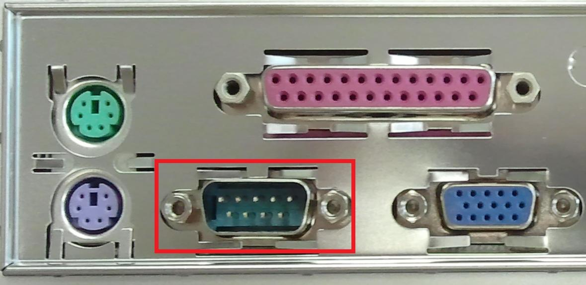
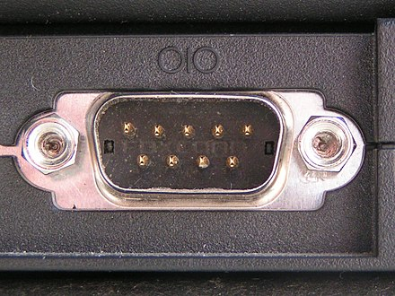
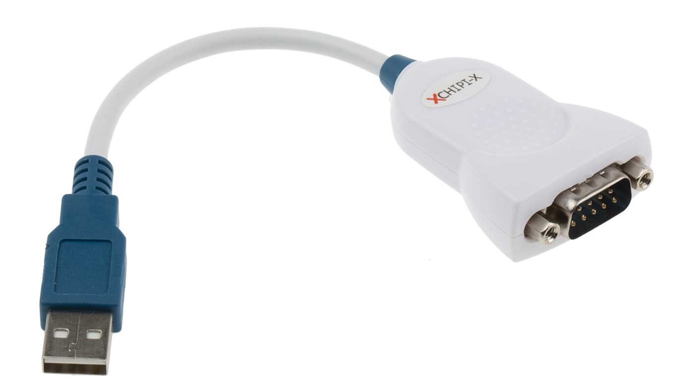
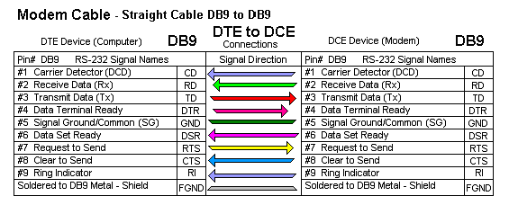
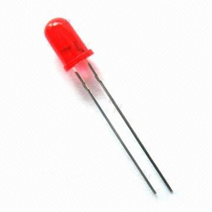
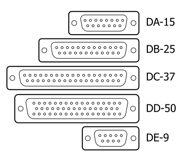

# Internet of Four Things

Converting a serial port into three digital outputs and one digital inputs.

## First get your serial port

Below shows a DE9 serial port that was common on older systems. If you have one of these you are done. 

More modern ports may look like this.

Modern systems may not have a serial port. In this case you will need to use a USB-Serial converter can be used. 

## A short discussion on RS232 signals

[RS232](https://en.wikipedia.org/wiki/RS-232#Data_and_control_signals) specifies how data terminating equipment (DTE) communicates to the data communication equipment (DCE). In this discussion, the computer/laptop is the DTE. 

Thanks to [wilbo6666](http://wilbo666.pbworks.com/w/page/49320712/RS232) for this fine image of the DE9[1](#de9Footnote1) pinouts.

From the computers (DTE) point of view, there are three output pins and five input pins and one ground pin. 

One pair of pins (RD and TD) are used for data which are not suitable for signalling. 

One pair of pins (DTR and DSR) are used to power the input pins and to simulate an active DCE ready for communication. 

This leaves one output pin and three input pins. 

## Schematic

## Usage

The output pins can power a small LED but not much more. 
Format: 

---

<a name="de9Footnote1">1</a>: The DE9 is often incorrectly called DB9. 

